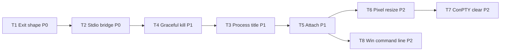

# Terminal Parity Plan (VS Code–like Editor Backend)

Follow-up to the implemented [editor backend plan](plan_editor_backend.md). Goal: close the remaining gaps between **MiniPty.Terminal** (+ core spawn surface) and **node-pty** so a VS Code–like editor can use MiniPty as a drop-in backend without surprises.

**Status:** planned (not started).

Research inputs: node-pty `IPty` / `spawn` typings, VS Code `TerminalProcess` / `PtyService` (title polling, flow control, `clearBuffer`, exit handling), and the gap list in [terminal.md](../specs/terminal.md) non-goals.

## Target bar

A VS Code–like editor needs MiniPty to:

1. Move raw PTY bytes in real time with backpressure (already done).
2. Report exit in the shape frontends expect (`exitCode` + optional `signal`, drain-then-exit ordering).
3. Expose the same operational knobs VS Code polls or calls (`resize`, title, optional buffer clear).
4. Integrate without inventing transport/protocol (reference bridge + sample).

Terminal emulation (screen buffer, ANSI parsing) stays out of scope.

## Priority legend

| Priority | Meaning |
|---|---|
| **P0** | Blocks credible VS Code–like integration or causes visible behavioral mismatch today |
| **P1** | Expected by VS Code internals or common editor UX; implement soon after P0 |
| **P2** | node-pty parity nicety; implement when a concrete embedder asks |
| **Won't** | Rejected or explicitly out of scope for this library |

## Gap inventory and priorities

| ID | Priority | node-pty / VS Code | MiniPty today | Planned resolution |
|---|---|---|---|---|
| T1 | **P0** | `onExit { exitCode, signal? }` — on Unix signal exit, `exitCode` is **0** and `signal` carries `WTERMSIG` | `PtyExitStatus.ExitCode` is `128 + signal`; `Signal` is correct | **Terminal-bound node-pty exit shape** (see [T1](#t1-node-pty-exit-code-reporting-p0)) |
| T2 | **P0** | Extension host bridges via helper process + framed I/O (documented pattern in [terminal.md](../specs/terminal.md)) | WebSocket bridge + browser sample only | **Stdio-framed bridge + minimal VS Code Pseudoterminal sample** (see [T2](#t2-stdio-bridge-and-vscode-reference-p0)) |
| T3 | **P1** | `IPty.process` — foreground command name; VS Code polls every 200 ms on Unix | Not exposed | **`ActiveProcessName` polling API** (see [T3](#t3-process-title-tracking-p1)) |
| T4 | **P1** | `kill()` with no argument → **SIGHUP** (graceful hangup) | `Kill()` → SIGKILL / `TerminateProcess` | **Default kill semantics option** (see [T4](#t4-default-kill-signal-p1)) |
| T5 | **P1** | Session reconnect / detach (VS Code persistent terminals) | Bridge owns session end-to-end (N5) | **`PtyTerminal.Attach(PtySession)`** + bridge reconnect design (see [T5](#t5-attach-and-reconnect-p1)) |
| T6 | **P2** | `resize(cols, rows, pixelSize?)` — pixel winsize on Unix | `Resize(PtySize)` cols/rows only | **Optional pixel dimensions on resize** (see [T6](#t6-pixel-size-resize-p2)) |
| T7 | **P2** | `clear()` — ConPTY buffer sync when frontend clears scrollback | Not supported (N7) | **Optional ConPTY clear** (see [T7](#t7-conpty-clear-p2)) |
| T8 | **P2** | Windows `spawn` accepts CommandLine string | `Arguments` list only | **Windows command-line spawn helper** (see [T8](#t8-windows-commandline-spawn-p2)) |
| T9 | **P2** | `conptyInheritCursor` | Not exposed | Defer unless ConPTY cursor bug is reported |
| T10 | **Won't** | `open()` / `openpty` without spawn | — | Out of scope until a concrete embedder needs it |
| T11 | **Won't** | `uid` / `gid` spawn | — | Security-sensitive; out of scope for minimal library |
| T12 | **Won't** | `encoding` spawn option (auto string decode) | bytes-first core | By design; decode at frontend boundary |
| T13 | **Won't** | `handleFlowControl` XON/XOFF string intercept | `Pause`/`Resume` + bridge ACK watermarks | VS Code uses pause/resume + ACK, not XON/XOFF |

Already at parity (no plan item): push output, drain-then-exit, pause/resume, `Kill(PtySignal)`, env overlay + terminal sanitize (`TMUX`/`STY`/…), `TERM` / `TerminalName`, WebSocket ACK flow control, signal number on `PtyExitStatus.Signal`.

---

## T1: node-pty exit code reporting (P0)

### Why P0

node-pty sets `exit_code = WEXITSTATUS` only when `WIFEXITED`; when `WIFSIGNALED`, `exit_code` stays **0** and `signal_code = WTERMSIG`. VS Code's `TerminalProcess` stores `e.exitCode` and fires `onProcessExit` with that value — it does **not** re-derive exit code from the signal.

MiniPty's `128 + signal` convention is correct for shell scripting and consistent with `PtySession.ExitCode`, but a VS Code–like host that maps `onDidClose.fire(exitCode)` from the bridge `exit` message will show **143** for SIGTERM instead of **0** unless we translate at the terminal boundary.

### Decision (proposed)

- **Keep** `PtyExitStatus.ExitCode` and `PtySession.ExitCode` as the shell-oriented value (`128 + signal` on Unix signal death). Do not break Capture, `CompleteAsync`, or existing tests.
- **Add** a node-pty-compatible projection used by **MiniPty.Terminal** and documented for Pseudoterminal integrators:

```csharp
// On PtyExitStatus (core, computed — no storage):
public int NodePtyExitCode => Signal is null ? ExitCode : 0;
```

- **`PtyWebSocketBridge`** exit JSON uses `NodePtyExitCode` for `exitCode`; `signal` unchanged.
- **`PtyTerminal.Completion`** continues to return full `PtyExitStatus`; embedders choose `NodePtyExitCode` when feeding editor close events.
- Document the dual view in [core_session.md](../specs/core_session.md) (WHY) and [terminal.md](../specs/terminal.md) (VS Code mapping).

### Acceptance

- Tests: signal-killed child → `ExitCode == 128 + n`, `NodePtyExitCode == 0`, `Signal == n`.
- Bridge test: exit message `exitCode` is 0 when `signal` is present.
- [plan_editor_backend.md](plan_editor_backend.md) lesson about deliberate `128 + signal` is updated to note the Terminal-layer projection.

### Estimate

Small (API surface + bridge + docs + tests). No native change.

---

## T2: Stdio bridge and VS Code reference (P0)

### Why P0

[terminal.md](../specs/terminal.md) documents the Pseudoterminal pattern but there is no shipped reference transport. VS Code extensions cannot P/Invoke; they need a **helper executable** speaking a stable framed protocol. Without it, "VS Code–like backend" remains theoretical.

### Decision (proposed)

- Add **`PtyStdioBridge`** (name TBD) in **MiniPty.Terminal**: same control messages as the WebSocket bridge (`resize`, `ack`, `exit`), length-prefixed binary frames on stdin/stdout (or stdout-only with fixed header — pick one and spec it).
- Reuse `BridgeJson`, `BridgeFlowControl`, and the `PtyTerminal` pump; only framing differs.
- Add **`samples/VsCodeTerminalHelper.cs`** (or similar): stdin/stdout bridge entry point an extension can spawn.
- Add a minimal **`.github/docs`** integration note (not a full VS Code extension repo) showing `handleInput` → binary frame, incremental `TextDecoder`, `onDidWrite` flush before `onDidClose`, ACK counting.

### Non-goals

- Publishing a marketplace VS Code extension (maintenance burden).
- HTTP/WebSocket inside the extension host.

### Acceptance

- CI smoke: spawn helper, send resize + marker command, assert marker output and node-pty-shaped exit frame.
- Documented byte-framing spec in [terminal.md](../specs/terminal.md).

### Estimate

Medium (new framing layer + sample + tests). Depends on T1 for exit JSON shape.

---

## T3: Process title tracking (P1)

### Why P1

VS Code polls `pty.process` on Unix every **200 ms** to update tab titles (`TerminalProcess._setupTitlePolling`). Without this, editor tabs show only the static shell name.

### Decision (proposed)

- Add **`string? ActiveProcessName { get; }`** on `PtyTerminal` (and optionally `PtySession` if useful outside Terminal).
- Implement per OS:
  - **Linux / FreeBSD:** `tcgetpgrp` on PTY fd → `kill(pid, 0)` + `/proc/<pid>/comm` (or `ps` fallback in tests only).
  - **macOS:** libproc / `proc_pidpath` or node-pty-equivalent `pty.process(fd)` native helper (evaluate smallest AOT-friendly path).
  - **Windows:** optional — VS Code uses `WindowsShellHelper` for title, not `IPty.process`; return `null` or shell file name on v1.
- Filter kernel/spawn noise (`spawn_helper`, `kernel_task`) like node-pty.
- No automatic polling inside the library — expose a cheap getter; the embedder polls (matches VS Code).

### Acceptance

- Integration test: run `sleep 30` in background, exec nested command, observe name change (Unix).
- Document polling contract in [terminal.md](../specs/terminal.md).

### Estimate

Medium–large (per-OS native or managed proc lookup; NativeAOT-safe).

---

## T4: Default kill signal (P1)

### Why P1

node-pty `kill()` defaults to **SIGHUP**. VS Code calls `ptyProcess.kill()` without a signal during normal teardown. MiniPty `Kill()` uses **SIGKILL** / `TerminateProcess`, which is harsher and can prevent graceful shell cleanup (history flush, job control).

### Decision (proposed)

- Add **`PtyKillOptions`** or an overload: `Kill(PtyKillMode mode = PtyKillMode.Force)` where `Graceful` maps to SIGHUP on Unix and existing terminate on Windows (node-pty has no signal on Windows).
- **Default for `PtyTerminal`:** `Graceful` to match node-pty; keep `PtySession.Kill()` default as forceful unless we decide library-wide alignment (breaking — prefer Terminal-only default).
- Document that embedders mimicking VS Code teardown should use graceful kill first.

### Acceptance

- Test: interactive shell receives SIGHUP on graceful kill; child can exit 0 without SIGKILL.
- Windows: behavior unchanged (terminate).

### Estimate

Small–medium.

---

## T5: Attach and reconnect (P1)

### Why P1

VS Code **persistent terminals** survive panel close and renderer disconnect. [terminal.md](../specs/terminal.md) N5 rejects v1 reconnect because the bridge owns spawn. `Attach(PtySession)` is the prerequisite.

### Decision (proposed)

1. **`PtyTerminal.Attach(PtySession, PtyTerminalOptions)`** — same pump/handler contract as `Start`; session must have no other active output consumer.
2. Design **`PtyBridgeOptions.Reconnect`** (or a separate `PtyWebSocketBridge.AttachAsync`) in a follow-up PR once Attach is proven.
3. On client disconnect: optional **keep-alive** mode (kill vs leave child running) — default remains kill for security; opt-in for editor parity.

### Acceptance

- Test: start session via core, attach terminal, verify output + completion.
- Spec update for N5 removal when reconnect ships.

### Estimate

Medium for Attach; large for full reconnect semantics.

---

## T6: Pixel-size resize (P2)

### Why P2

node-pty and VS Code accept optional `pixelWidth`/`pixelHeight` for fixed dimensions. Most sessions only pass cols/rows; pixel size is ignored on Windows.

### Decision (proposed)

- Extend `PtySize` or add `PtyPixelSize?` optional on `Resize`.
- Unix: set `ws_xpixel` / `ws_ypixel` in `TIOCSWINSZ`.
- Windows: no-op (documented).

### Estimate

Small on Unix; core API extension.

---

## T7: ConPTY clear (P2)

### Why P2

VS Code `clearBuffer()` calls `IPty.clear()`, which invokes `ConptyClearPseudoConsole` when using **conpty.dll**. Without it, clearing the frontend scrollback can leave ConPTY reprinting stale screen content on Windows.

### Options

| Option | Pros | Cons |
|---|---|---|
| Ship **conpty.dll** as optional native asset (like node-pty `useConptyDll`) | Full parity | Third-party binary; AGENTS.md tension; packaging complexity |
| Wait for public Windows API | Clean | No timeline |
| Document "no-op on Windows" | Zero cost | Residual redraw glitches |

### Decision (proposed)

- **Defer implementation** until an embedder reports the glitch on modern Windows ConPTY (in-box, not DLL).
- Revisit shipping a **optional** redistributable only if glitch is confirmed and API remains unavailable.
- **`PtyTerminal.Clear()`** stub that no-ops on Unix and documents Windows limitation until then.

### Estimate

Large if DLL route; trivial for documented no-op.

---

## T8: Windows CommandLine spawn (P2)

### Why P2

node-pty on Windows allows `args` as a pre-escaped CommandLine string. Some hosts build a single command line for `cmd.exe /c`.

### Decision (proposed)

- Add `PtyStartInfo.CommandLine` (Windows-only, mutually exclusive with `Arguments`) or a `PtyWindowsStartInfo` nested option.
- Document quoting rules and link to Microsoft CommandLine docs (same as node-pty typings).

### Estimate

Small–medium (spawn path branch in `WindowsPtyBackend`).

---

## Suggested implementation order



| Phase | Items | Outcome |
|---|---|---|
| **Phase A** | T1, T2 | Editor can integrate via helper; exit matches node-pty / VS Code |
| **Phase B** | T4, T3 | Tab titles and teardown behavior match VS Code expectations |
| **Phase C** | T5 | Persistent / reconnect sessions become possible |
| **Phase D** | T6, T8, T7 | Remaining node-pty options on demand |

## Documentation touchpoints (after each phase)

- [specs/terminal.md](../specs/terminal.md) — protocol, VS Code mapping, non-goals
- [specs/core_session.md](../specs/core_session.md) — `NodePtyExitCode`, resize pixel fields if added
- [spec.md](../spec.md) — Planned scope table
- [plan_editor_backend.md](plan_editor_backend.md) — link here from Deferred / future

## Open questions

- Should `PtySession.Kill()` default change to SIGHUP library-wide (breaking) or only `PtyTerminal`?
- Is a minimal conpty.dll optional package (`MiniPty.Windows.Conpty`) acceptable under AGENTS.md, or always rejected?
- For T3, is managed `/proc` polling sufficient on Linux CI, or is a small native `pty.process` helper required for macOS parity?

## Related documents

- [plan_editor_backend.md](plan_editor_backend.md) — implemented use case 4 baseline
- [specs/terminal.md](../specs/terminal.md) — Terminal package contract
- [node-pty IPty typings](https://github.com/microsoft/node-pty/blob/main/typings/node-pty.d.ts)
- [VS Code TerminalProcess](https://github.com/microsoft/vscode/blob/main/src/vs/platform/terminal/node/terminalProcess.ts)
