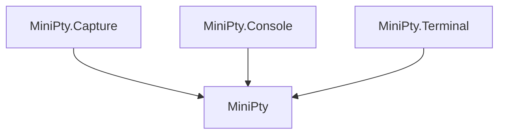

# MiniPty Specification

User-facing specification entry point for **MiniPty**, **MiniPty.Capture**, **MiniPty.Console**, and **MiniPty.Terminal** NuGet packages. Detailed contracts are split by behavior area under [specs/](specs/). OS-level implementation notes live in [references/](references/) (for example [pty_crossplatform.md](references/pty_crossplatform.md), [windows_console_input.md](references/windows_console_input.md)).

## Motivation

Many CLI tools and terminal UIs behave differently when stdout is not a TTY: they disable color, skip animations, or refuse to run. A pseudo-terminal gives the child real terminal semantics while the parent reads and writes a byte stream.

MiniPty exists as a **standalone, NativeAOT-friendly** library so any .NET program can spawn PTY children without bundling winpty or external helpers. Observation semantics are split into **MiniPty.Capture** so core callers that only need streams and exit codes are not forced to depend on capture types.

## Use Cases

| # | Goal | Primary packages | Specification |
|---|---|---|---|
| **1** | PTY transport (node-pty–equivalent core) | **MiniPty** | [Core session](specs/core_session.md), [Lifecycle](specs/lifecycle.md) |
| **2** | One-shot stdin + timestamped record | **MiniPty.Capture** | [Capture](specs/capture.md) |
| **3** | Interactive host (vim, etc.) — human types on real terminal | **MiniPty** + **MiniPty.Console** | [Console](specs/console.md) (embedder owns `ReadOutputAsync`) |
| **4** | In-editor terminal backend (xterm.js, etc.) | **MiniPty** + **MiniPty.Terminal** | [Terminal](specs/terminal.md) (push facade, WebSocket bridge, flow control) |

Use case 3 recording and cast format remain **scenetake** (or other embedder) responsibilities. **MiniPty.Console** does not record output.

## Package Responsibilities

| Package | Purpose | Depends on |
|---|---|---|
| **MiniPty** | Core PTY transport: spawn, streams, lifecycle | — |
| **MiniPty.Capture** | One-shot run with per-read timestamps (`PtyCapture.RunAsync`) | MiniPty |
| **MiniPty.Console** | Host keyboard → PTY input (`PtyConsoleInput.Attach`) | MiniPty |
| **MiniPty.Terminal** | Frontend terminal backend: push facade, WebSocket bridge, and stdio helper bridge | MiniPty |

| You need… | Packages |
|---|---|
| General PTY I/O, `ReadOutputAsync`, `CompleteAsync` | **MiniPty** |
| One-shot command with timestamped output chunks | **MiniPty** + **MiniPty.Capture** |
| Human types on the host terminal (vim, etc.) | **MiniPty** + **MiniPty.Console** (+ your `ReadOutputAsync` for display/record) |
| Backend PTY for xterm.js / editor terminals (push events, flow control, WebSocket) | **MiniPty** + **MiniPty.Terminal** |

**MiniPty.Capture**, **MiniPty.Console**, and **MiniPty.Terminal** are optional add-ons. All depend on core only; Console does not read PTY output; Terminal owns its session's output exclusively.

## Implemented Scope

| Goal | Specification |
|---|---|
| Spawn and control a PTY-backed child process | [Core session](specs/core_session.md) |
| Consume persistent bytes-only PTY output | [Core session](specs/core_session.md), [Lifecycle](specs/lifecycle.md) |
| Run a one-shot command with optional stdin and drained output | [Completion](specs/completion.md) |
| Observe one-shot output with per-read timestamps | [Capture](specs/capture.md) |
| Convert PTY text into host-readable output | [Display text](specs/display_text.md) |
| Understand architecture, session flow, cancellation, EOF, drain, and disposal | [Lifecycle](specs/lifecycle.md) |
| Understand supported OS targets and public platform guarantees | [Platform support](specs/platform_support.md) |
| Persistent transport sample (`ReadOutputAsync` command loop) | [samples/Interactive.cs](../../samples/Interactive.cs) |
| Attach host terminal input to an existing `PtySession` (use case 3) | [Console](specs/console.md) |
| Exit status with Unix termination signal; `Kill(PtySignal)` | [Core session](specs/core_session.md) |
| Backend PTY for frontend terminals: push facade, flow control, WebSocket and stdio bridges (use case 4) | [Terminal](specs/terminal.md) |
| Browser terminal sample (xterm.js over WebSocket) | [samples/WebTerminal.cs](../../samples/WebTerminal.cs) |
| VS Code helper sample (length-framed stdio) | [samples/VsCodeTerminalHelper.cs](../../samples/VsCodeTerminalHelper.cs) |

## Planned Scope

| Goal | Plan |
|---|---|
| Bridge-managed persistent terminal reconnect | [plans/plan_terminal_parity.md](plans/plan_terminal_parity.md) follow-up from T5 |

## Out of Scope For The Current Implementation

- Terminal emulation, TUI replay, or faithful screen-buffer rendering
- Cast / asciinema recording (embedder responsibility; scenetake for example)
- Windows ConPTY `clear()` (requires the conpty.dll signal pipe; not reachable via public Win32 API)
- Bridge-managed session registry and reconnect protocol ([Terminal](specs/terminal.md) non-goal N5)
- Remote shells (`ssh`)
- Spilling capture to disk when memory is exhausted
- Capture tuning such as max chunk size or chunk timestamp modes

Planning notes for Console implementation are in [plans/plan_minipty_next.md](plans/plan_minipty_next.md); the editor terminal backend (use case 4) decision record is in [plans/plan_editor_backend.md](plans/plan_editor_backend.md). Planning documents are not implemented API contracts unless mirrored in [specs/](specs/).

## Related Documents

- [specs/core_session.md](specs/core_session.md) — `Pty.Start`, `PtySession`, streams, resize, wait, kill, dispose, embedder patterns
- [specs/completion.md](specs/completion.md) — `CompleteAsync`, `PtyCompleteOptions`, `PtyResult`
- [specs/capture.md](specs/capture.md) — `MiniPty.Capture` timestamped observation
- [specs/console.md](specs/console.md) — `MiniPty.Console` host input attach
- [specs/terminal.md](specs/terminal.md) — `MiniPty.Terminal` frontend terminal backend (use case 4)
- [specs/display_text.md](specs/display_text.md) — `PtyOutput.ToDisplayText`
- [specs/lifecycle.md](specs/lifecycle.md) — mental model, session flow, cancellation, EOF, drain, disposal, failure behavior
- [specs/platform_support.md](specs/platform_support.md) — public platform support and verification constraints
- [references/pty_crossplatform.md](references/pty_crossplatform.md) — ConPTY, `forkpty`, EOF staging, interop details
- [references/windows_console_input.md](references/windows_console_input.md) — Windows host stdin path for **MiniPty.Console**
- [README.md](../../README.md) — quick-start examples
- [scenetake spec_pty.md](https://github.com/guitarrapc/scenetake/blob/main/.github/docs/spec_pty.md) — `pty: true` YAML and cast integration (use case 2 today)
